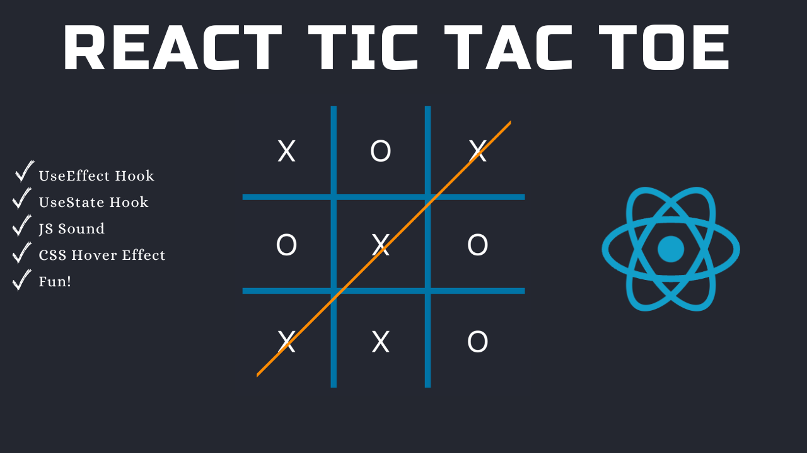
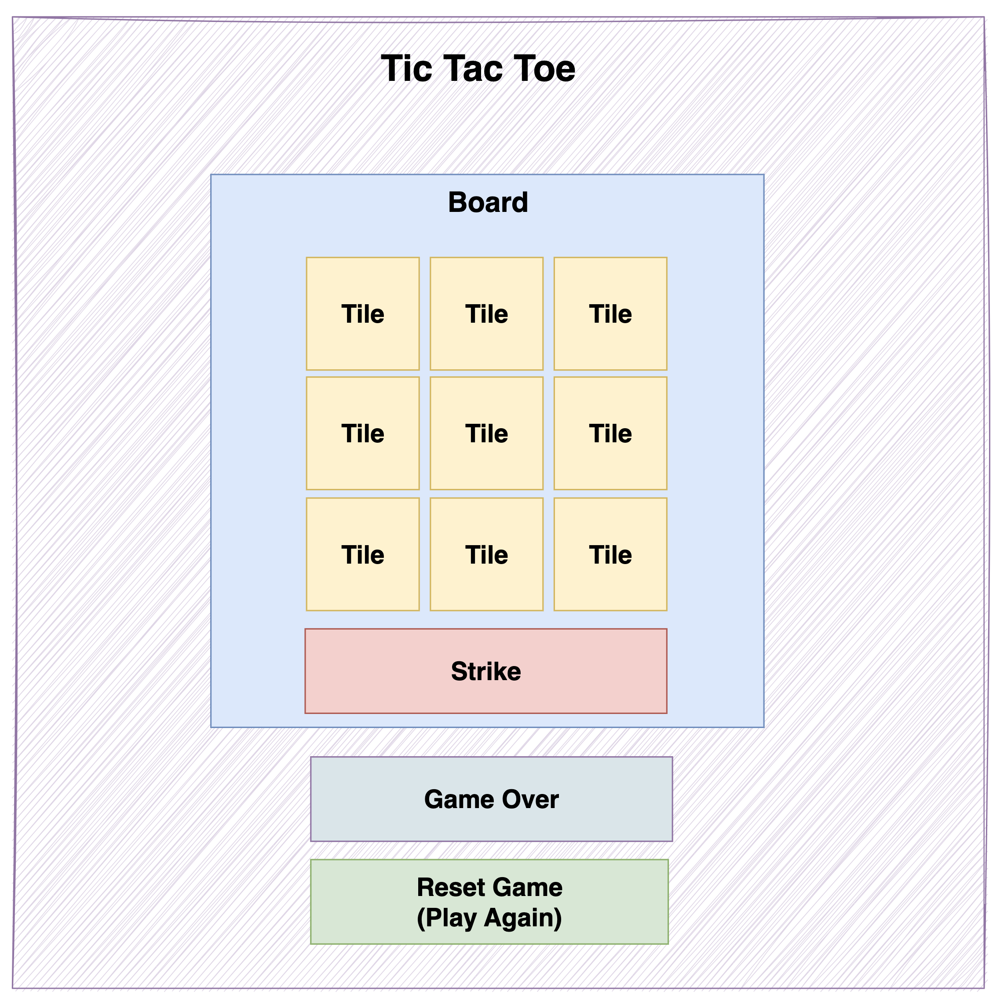

# Tic Tac Toe With React

### YouTube Tutorial:

https://youtu.be/4Gt_YyGf6B0?si=u8eITdczbHkTIY6e

### Try the game here:

https://codingwith-adam.github.io/tic-tac-toe-react/

In this Tutorial we are going to build an awesome version of Tic Tac Toe using React.

Learn React concepts such as thinking in components, useState hook, useEffect hook, prop drilling. We also cover JS audio, CSS concepts such as flex-box and grid for display and more to create a delightful UI.

The following component diagram is used to help us think in components.

If you enjoy this tutorial please subscribe, like and share on YouTube.
